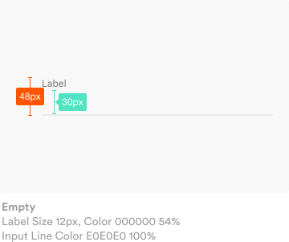
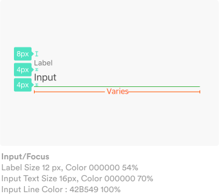
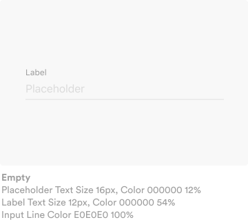
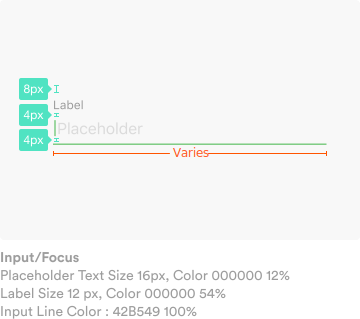
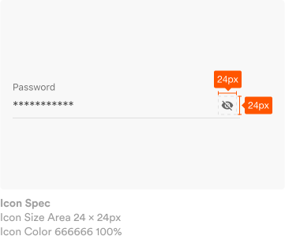
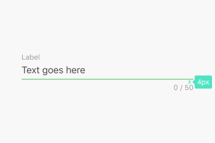

**Text Fields** allow users to input, edit, and select text.

## Usage

  

    Text fields typically reside in forms but can appear in other places, like dialog boxes and search.
  

  

    
  

## Atom & Specs

<b>Label</b>

  

    Text field labels display the type of input a field requires. Every text field should have a label. Label floating above the input line.
  

  

    
  

  

    
  

<b>Placeholder (Hint text)</b>

  

    Placeholder text rests in the input field until the user starts entering text. It may contain an action or an example, such as a phone number or email address.
  

  

    
  

  

    
  

<b>Helper</b>

  

    Helper text gives context about a field’s input, such as how the input will be used. It should be visible either persistently or only on focus.
  

  

    
  

  

  

<b>Cursor</b>

  

    The cursor indicates the user’s current input position.
  

  

    
  

  

  

<b>Icon</b>

  

    Icon help to describe the required text field. They are displayed on the right of the text field. 
      
    Icon can also be touchable in order to reveal the purpose of itself, such as drop down icon to reveal a choice of menus.
  

  

    
  

  

    
  

<b>Character or word counter</b>

  

    Use character or word counters where there is a character or word limit. Specs:
    <ul class="mt-8">
      <li>Right justified</li>
      <li>Displayed as a ratio of characters used and the character limit (formatted as: characters used / character limit</li>
    </ul>
  

  

    
      
    
  

  

    
  

## State

<b>Enabled</b>

  

    Enabled text fields are the state where user can input any given text fields. Empty by default or covered with placeholder that will replace with user’s input.
  

  

    
  

<b>Disabled</b>

  

    Disabled text fields are the state where user can not fill up due to some constraint coming from any possibilities. They have stripped input line and less opacity that thet appear less tapable.
  

  

    
  

<b>Focus</b>

  

  As the user types into the text field, input text replaces any placeholder text. Autocompleted text is displayed to the right of the cursor, using the same font size and color as placeholder text.
  

  

    
  

<b>Error Message</b>

  

  When input isn’t accepted, text fields can display an error message below the input line, with instructions on how to fix the error. Until the error is fixed, the error replaces the helper text. An error message should appear on a single line, if possible.
  

  

    
  

